# FirmLab

**A local-first firmware analysis workbench that never overclaims what it found.**

Upload a firmware image and FirmLab gives you an immediate, visual breakdown — a binwalk-style structure map,
an entropy graph, inferred identity, extracted filesystem, secrets, an SBOM with known-CVE matches, and an
arch-aware **emulation ladder**. On top of that deterministic base sits an optional, flag-gated agent that
*reasons within* a fixed skeleton (never a blank agent loop), and a persistent corpus that learns across every
image you feed it.

<p>
  
  
  
  
  
  
  
  
  
  
</p>

> **Status:** active, solo-built engineering project — Phases 0–5 shipped, more on the [roadmap](#-project-status--roadmap).
> ~14.7k lines of TypeScript, 210+ tests, validated against real tools in-container.
> **Local-only by design:** the API binds to loopback and is never meant to face the internet.

<p align="center">
  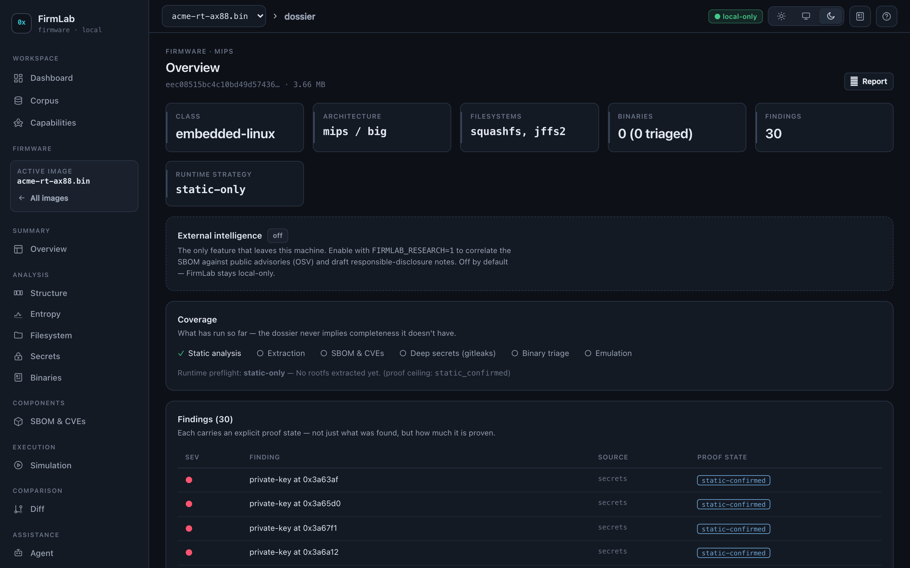
  <br>
  <sub><i>The dossier for an analyzed image: inferred identity, what has actually run so far, and a findings ledger where every entry carries an explicit <b>proof-state</b> — not just what was found, but how much of it is proven.</i></sub>
</p>

---

## Table of contents

- [The idea in one minute](#the-idea-in-one-minute)
- [What makes it different](#what-makes-it-different)
- [Architecture](#architecture)
- [How an image flows through the system](#how-an-image-flows-through-the-system)
- [The emulation ladder](#the-emulation-ladder)
- [The proof-state machine — honesty, encoded](#the-proof-state-machine--honesty-encoded)
- [The agent — autonomy *with a skeleton*](#the-agent--autonomy-with-a-skeleton)
- [External intelligence (opt-in)](#external-intelligence-opt-in)
- [Tech stack](#tech-stack)
- [Quick start](#quick-start)
- [Project status & roadmap](#-project-status--roadmap)
- [Repository layout](#repository-layout)
- [Testing & quality](#testing--quality)
- [Safety & responsible use](#safety--responsible-use)

---

## The idea in one minute

Most firmware tools are **tool-first**: install a big toolchain, run it, read a wall of output. FirmLab inverts
that. Everything that can be computed from the bytes alone — entropy, magic-signature carving, the structure
map, identity inference, secret extraction, MCU fingerprinting — lives in a **pure, zero-dependency TypeScript
engine** (`@firmlab/core`) that runs the instant an image is uploaded. Heavy external tools (binwalk, radare2,
QEMU, Renode, syft/grype, gitleaks, AFL++) are **optional enhancers**, auto-detected at runtime. The workbench
is useful with nothing installed and *better* with the full image — it degrades gracefully instead of
hard-failing.

The through-line of the whole project is **intellectual honesty about evidence.** A hardcoded credential found
in a string is a *lead*, not a proven vulnerability. FirmLab tracks every finding through an explicit
**proof-state machine** and refuses to promote a claim past what it can actually demonstrate — a shell under
QEMU proves the *sandbox*, never the physical device. That discipline is the backbone everything else is built
on.

## What makes it different

| Principle | How it shows up in the code |
|---|---|
| **Deterministic core, tools optional** | `@firmlab/core` is pure and unit-tested; external tools are runtime-detected *providers* that light up capabilities as they appear. |
| **Honesty is a state machine** | Every finding carries a `ProofState`; the preflight computes an *honest ceiling* per deployment, and code — not the model — clamps claims to it. |
| **Emulation as a ranked ladder** | A planner turns identity + rootfs into arch-aware, runnable recipes; the runner only claims what it reproduced. |
| **Autonomy with a skeleton** | The optional agent *chooses branches* on a fixed deterministic orchestrator, bounded by a governor (steps/tokens/USD/wall-time) and a human-approval gate. |
| **Stateful — it learns** | A persistent cross-image **corpus** links shared artifacts, reused credentials and common components across firmware, and promotes repeat offenders to a watchlist. |
| **Local-only DNA** | No network at all unless you opt in; the internet-touching *research* track lives behind a separate flag with an allowlist and an egress ledger that states exactly what leaves the machine. |

## Architecture

A three-layer TypeScript monorepo. The dependency arrow points *down*: the web talks only to the API, the API
composes the pure core, and the core knows nothing about either.

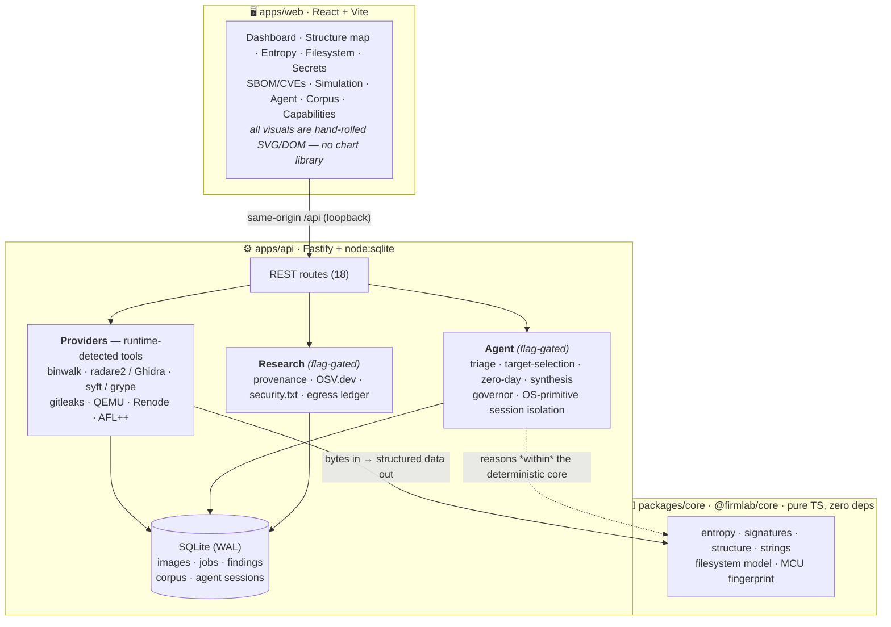

**Why this shape?** The pure core means the product has value with zero tools installed and is fully
unit-testable without Docker. Slow work (extraction, emulation, fuzzing) runs as **persisted SQLite jobs** with
streamed logs, so the UI polls without blocking and results survive a restart. The agent and research layers are
strictly *additive* — turn both flags off and FirmLab is a deterministic, offline workbench.

## How an image flows through the system

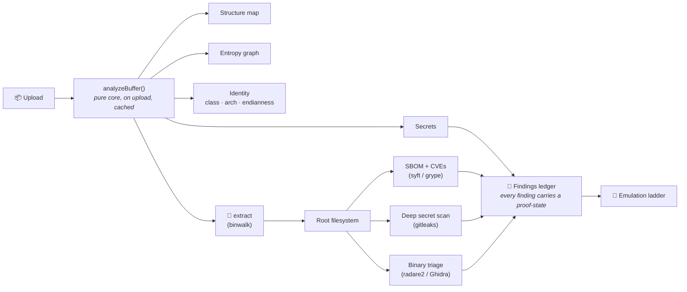

The moment an image lands, the core bundle runs and identity + analysis are persisted, so every view loads
instantly from cache; the raw bytes are only re-read for extraction and emulation. Entropy uses an adaptive
window so the sample count stays roughly constant regardless of image size.

<details>
  <summary><b>🖼️ A look at the workbench</b> — the deterministic analysis views (click to expand)</summary>

  <br>

  **Structure map** — a proportional, color-by-category ribbon of the whole image (signature-carved layout).
  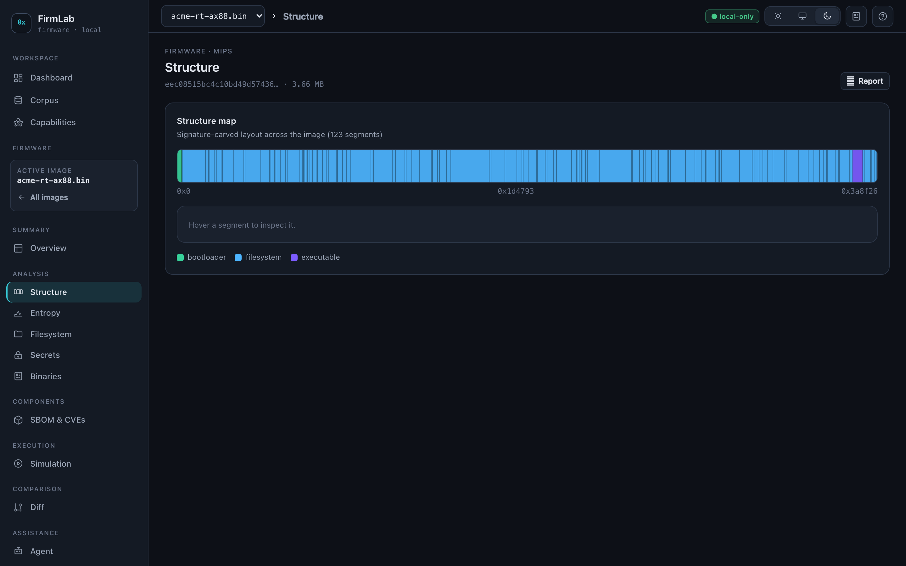

  **Entropy profile** — Shannon entropy across offset, with the 7.2 compressed/encrypted floor and a
  high-entropy region table.
  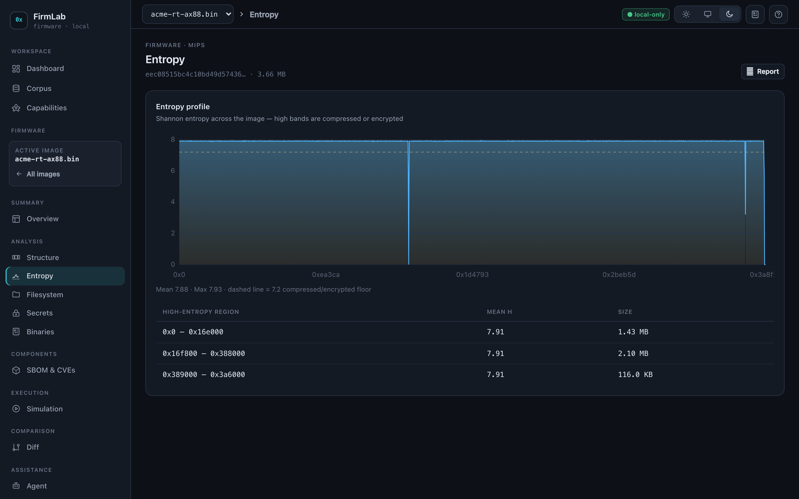

  **Secrets** — hardcoded credentials, private keys, tokens, connection strings and vendor default markers,
  each with a severity and its byte offset.
  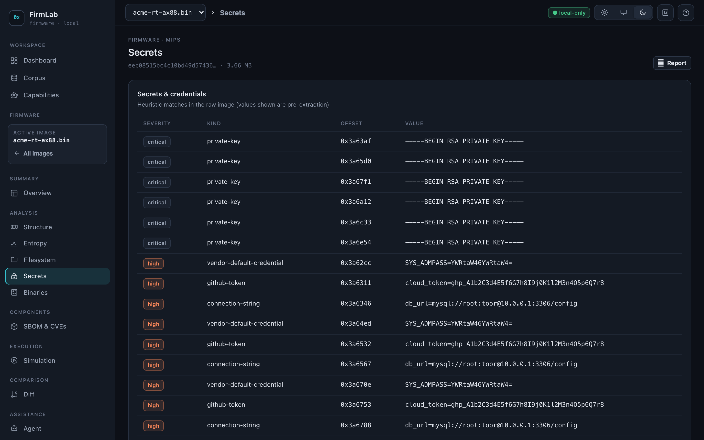

  **Dashboard** — drag-drop intake; every image is analyzed locally on upload. *Nothing leaves the machine.*
  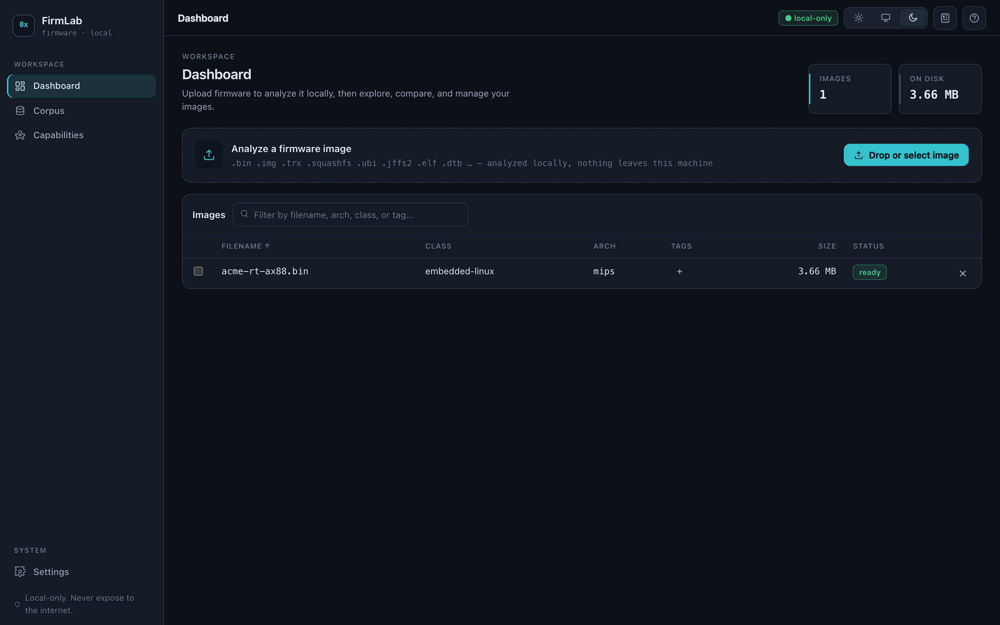

</details>

## The emulation ladder

Dynamic analysis is a **ranked ladder**, cheapest-viable first. Before anything runs, a deterministic
*preflight* inspects the arch, whether a rootfs was extracted, which emulators are installed, and which on-image
assets exist — then decides the best strategy the deployment can actually run, and the honest proof-state
ceiling it may claim.

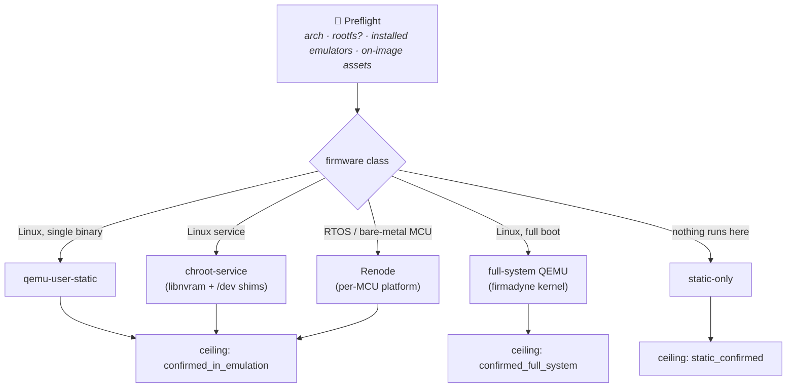

The **Renode / RTOS rung** is a recent focus. FirmLab fingerprints the MCU straight from the bytes — the memory
map (an ELF's load addresses, or a raw image's ARM Cortex-M vector table → flash/RAM bases) plus vendor/SDK/RTOS
string markers — then selects a platform from *Renode's actual bundled catalog* (216 platforms in v1.16.1), so
coverage tracks the install rather than a hardcoded family list. If it can't identify a vendor family it blocks
honestly instead of booting a guess. Validated in-container: a real STM32F4 Discovery firmware boots and prints
`Contiki 3.x started` on `uart4`.

<p align="center">
  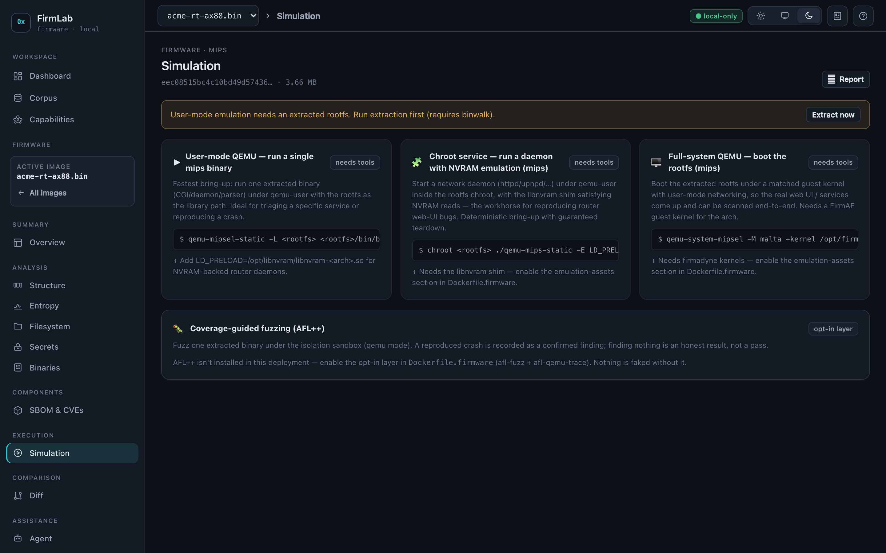
  <br>
  <sub><i>The emulation menu ranks every rung the image supports, shows the <b>exact command</b> for each, and is honest about what this deployment can actually run (<code>needs tools</code> / <code>opt-in layer</code>) — it never offers a one-click boot that would silently fail.</i></sub>
</p>

## The proof-state machine — honesty, encoded

This is the heart of the project. A finding never claims more than the evidence supports; emulated proof is
never conflated with device compromise; a target that can't run here is *downgraded honestly* rather than
overstated.

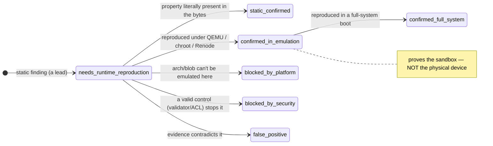

## The agent — autonomy *with a skeleton*

The optional agent (behind `FIRMLAB_AGENT`) does **not** get a blank loop and a pile of tools. It reasons
*within* a deterministic orchestrator: the mechanics (extraction, preflight, emulation) are fixed code; the LLM
only makes the **judgment calls** — what to triage, which target to attack, whether a taint path is reachable —
each written to an auditable, resumable transcript. A **governor** halts the run at the first hard cap
(steps · tokens · USD · wall-time). Emulation is gated behind **human approval**, *unless* the blast radius is
fully contained by OS-primitive isolation (`prlimit` + a fresh network namespace + guaranteed teardown), in
which case it may auto-run.

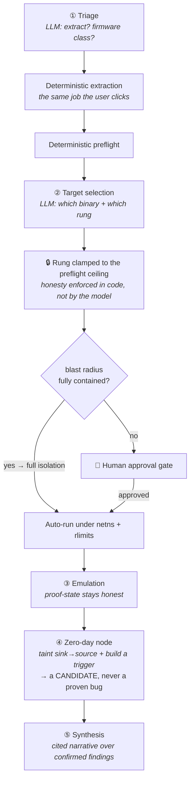

> Every step runs inside the **governor's** hard budget; node ④ produces *candidates* bound to
> `needs_runtime_reproduction` — only a real trigger run, decided by code, upgrades them.

## External intelligence (opt-in)

FirmLab is local-only by default. The one internet-touching capability lives behind its **own** separate flag
(`FIRMLAB_RESEARCH`, distinct from `FIRMLAB_AGENT`) so the deterministic, offline DNA is never compromised by
accident. When enabled, it correlates the SBOM against **OSV.dev** published advisories, fingerprints
**provenance** (vendor/model/version) and discovers the vendor's disclosure contact via RFC 9116
(`security.txt`) — but only for allowlisted domains. Every fetch passes an allowlist choke point and an **egress
ledger** that states exactly what leaves the machine (names and versions — *never raw firmware bytes*). A
published advisory for a present component is a *lead*, not a confirmed bug; reachability is decided per-image.

## Tech stack

| Layer | Choices |
|---|---|
| **Language** | TypeScript end-to-end (strict), ESM, pnpm workspaces |
| **Core engine** | Pure TS, zero runtime deps — entropy, signatures, structure, strings, filesystem, MCU fingerprint |
| **API** | Fastify · `node:sqlite` (WAL) · in-process job runner · runtime tool detection |
| **Web** | React + Vite · hand-rolled SVG/DOM visuals (no chart lib) · light/dark/system theming · PWA |
| **Emulation** | `qemu-user-static` · `qemu-system-*` · Renode (RTOS/MCU) |
| **Security tooling** | binwalk · radare2 / Ghidra · syft / grype · gitleaks · AFL++ · OSV.dev |
| **Agent/LLM** | Provider-agnostic (DeepSeek-first) · structured-output decision nodes · governor · session isolation |
| **Quality** | Vitest (210+ tests) · Biome (lint/format) · Docker-based real-tool validation |

## Quick start

### Docker (recommended)

```bash
# Static-analysis workbench — no firmware toolchain, tiny image:
docker compose up --build
# → http://127.0.0.1:8799   (loopback only)

# Full capabilities (binwalk, QEMU, radare2, syft/grype, gitleaks, …):
docker build -t firmlab:latest .
docker build -f Dockerfile.firmware -t firmlab-firmware .
# then set `image: firmlab-firmware` in docker-compose.yml and `docker compose up`
```

### Local dev

```bash
pnpm install
pnpm --filter @firmlab/core build          # build the engine (web + api consume it)

# terminal 1 — API on 127.0.0.1:8799
pnpm --filter @firmlab/api build && pnpm dev:api

# terminal 2 — web dev server on 127.0.0.1:5174 (proxies /api → :8799)
pnpm dev:web
```

Optional layers are off unless you set their flag: `FIRMLAB_AGENT=1` (agent/copilot, needs an LLM key) and
`FIRMLAB_RESEARCH=1` (external intelligence). See [`docs/DEPLOYMENT.md`](docs/DEPLOYMENT.md) for the homelab
rollout and how to tell which commit is running.

## 🚧 Project status & roadmap

FirmLab is built in phases, each shipping standalone value. **Phases 0–1 need no LLM at all**; the agent is
layered on later, always additive.

| Phase | Theme | Status |
|---|---|---|
| **0** | Proof-states, findings ledger, binaries table, preflight, emulation-ladder providers | ✅ Shipped |
| **1** | Persistent cross-image **corpus**, cross-refs, rule watchlist, corpus web views | ✅ Shipped |
| **2** | Read-only **copilot** (multi-provider LLM, proof-state discipline, dossier) | ✅ Shipped |
| **3** | **Decision nodes** ①②, governor, auditable/resumable sessions, human-approval gate | ✅ Shipped |
| **4** | **Zero-day** node ④, deterministic taint scaffold, OS-primitive session isolation, opt-in AFL++ | ✅ Shipped |
| **5** | External **intelligence** — provenance + OSV + security.txt, egress ledger (own flag) | ✅ Shipped |
| **▶** | **In progress** — broader Renode MCU coverage, per-class fuzz harnesses, more advisory sources, UI test coverage | 🔨 Ongoing |

Earlier phases hardened the deterministic workbench itself: arch refinement, gitleaks deep-scan, firmware diff
with content hashes, report export, a bounded job queue, data retention/quota, an expanded signature pack, Ghidra
decompilation, API defense-in-depth, and an e2e integration fixture. Full history in
[`docs/ROADMAP.md`](docs/ROADMAP.md); the design rationale for the autonomy work is in
[`docs/AGENT-DESIGN.md`](docs/AGENT-DESIGN.md).

## Repository layout

```
firmlab/
├─ packages/core/     @firmlab/core — pure analysis engine (entropy, signatures, structure,
│                     strings, filesystem, MCU fingerprint) · zero deps · fully unit-tested
├─ apps/api/          @firmlab/api — Fastify + node:sqlite · 18 routes · 21 providers
│  ├─ providers/      extract · sbom · gitleaks · diff · ghidra · emulate · renode · fuzz
│  │                  · isolate · taint · trigger · preflight · report · keys · provenance · osv …
│  ├─ agent/          session orchestrator · decision nodes · governor · zero-day · synthesis
│  └─ research/       allowlist config · egress ledger
├─ apps/web/          @firmlab/web — Vite + React workbench (SVG/DOM visuals, theming, PWA)
├─ docs/              ARCHITECTURE · AGENT-DESIGN · DEPLOYMENT · ROADMAP
└─ Dockerfile · Dockerfile.firmware · docker-compose.yml   (loopback-published)
```

## Testing & quality

- **210+ tests** (Vitest) across the three packages — the pure core and every provider's decision logic are
  unit-tested without needing the real tool installed.
- **Real-tool validation in Docker.** Beyond unit tests, changes are exercised against the actual toolchain
  in-container: a 12-assertion integration run over the real provider chain (extract → SBOM → gitleaks →
  decompile), and end-to-end checks such as a real AFL++ coverage-guided crash and a real Renode RTOS boot.
- **Biome** for lint + format across the monorepo; **strict TypeScript** everywhere.

## Safety & responsible use

FirmLab is a **defensive / research** tool. Analyze only firmware you own or are explicitly authorized to
assess. It binds to loopback by design and is never meant to be exposed to the internet — don't change the
publish binding. The zero-day and external-intelligence capabilities are opt-in, defensive-only (candidates and
*drafted* disclosure reports — never auto-send, never auto-exploit), and gated behind explicit flags.

---

<sub>Personal research project · built and maintained solo · in active development.</sub>
