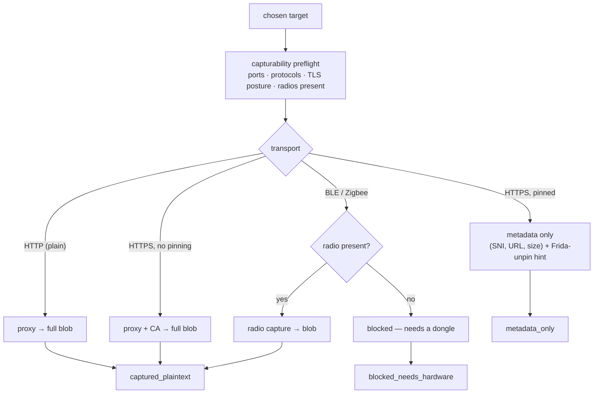
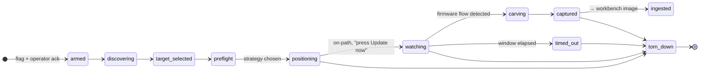

# FirmLab — Capture & Acquisition (Phase 6 design)

> Status: **6.0–6.4 + 6.6 shipped; 6.5 (Zigbee) deferred.** The design below is the full plan. **6.0** (discovery +
> backend detection + provenance schema), **6.1** (network capture via proxy + firmware-aware carving + auto-ingest),
> **6.2** (active ARP-spoof positioning + the token-authed LAN capture agent), **6.3** (capturability ladder +
> preflight + pinning metadata + Frida unpin template), **6.4** (Nordic-style BLE DFU reassembly), and **6.6** (the
> learning surface — OTA timeline + per-vendor priors + CDN graph) are built and validated — `apps/api/src/capture/` (config, backend registry, discovery scan, the mitmproxy
> interception runner `proxy.ts`, the pure `flow-manifest.ts`, the `ingest.ts` acquire→analyze bridge),
> `providers/discover.ts` + `providers/flowscore.ts`, the non-image-scoped `capture_sessions`/`devices`/
> `capture_flows` tables + the `capture_provenance` record, the `/capture/*` routes, and the top-level **Capture**
> web section (radar + scored flow feed + one-click ingest). Gated behind `FIRMLAB_CAPTURE` (off → nothing touches
> the wire). This doc preceded the code the same way [`AGENT-DESIGN.md`](AGENT-DESIGN.md) preceded the agent.

## 1. Why — closing the loop

Today FirmLab starts at *"you already have the firmware blob."* Every capability — structure map, secrets, SBOM,
emulation, the agent, the corpus — assumes an image is sitting on disk. **Capture** adds the missing first step:
**acquire the firmware from a live device**, in-flight, the moment it updates.

Concretely: you're about to tap **Update** in the vendor's mobile app for a smart bulb or a robot vacuum. FirmLab
gets on-path for that one device, watches the OTA download, carves the firmware out of the traffic, and **ingests
it straight into the workbench** — where the rest of FirmLab already knows what to do with it.

The payoff is bigger than "a nicer mitmproxy," because FirmLab already *understands firmware*:

- **Acquire → analyze in one motion.** A carved blob becomes a normal FirmLab image (`analyzeBuffer` → structure,
  secrets, emulation) with its acquisition provenance attached.
- **Learn across versions.** Capture the same device at v1.2 today and v1.3 next month; the corpus links them and
  the existing `diff` provider shows exactly what changed — new binaries, rotated keys, reused credentials, a
  changed CDN. Over time FirmLab builds a picture of *how each vendor ships OTA*.
- **Centralize.** Device inventory, OTA endpoints, versions, transports, TLS posture, and the blobs themselves all
  land in one place and accumulate.

## 2. Where it sits — FirmLab's second network-touching lane

FirmLab already reaches the network in one place: the **research** lane (`FIRMLAB_RESEARCH` — OSINT provenance,
OSV correlation). Capture is the **second** such lane, and that is fine — reaching onto the wire to pull a device's
OTA is the natural evolution of a firmware workbench, not a violation of it. We are past treating "local-only" as
a constraint to defend; it is simply the *default posture of a fresh `docker run`*, and specific lanes opt out of
it on purpose.

What we keep from FirmLab's DNA — because it makes the feature *correct*, not because of purity:

- **Deterministic skeleton, honest degradation.** Capture is a ladder of strategies; the system picks the best one
  available and is honest about the ceiling (plaintext blob vs. encrypted vs. metadata-only vs. needs-hardware).
- **Capabilities auto-detected at runtime** (same idea as `detectTools`): plug a radio, gain a transport.
- **Human-in-the-loop trigger.** FirmLab arms the capture; *you* press Update in the app. It is not a 24/7 sniffer.
- **Bounded and reversible.** One target, a time-boxed window, and **guaranteed teardown** (restore ARP tables,
  stop the proxy) — the same discipline as `providers/isolate.ts`.

Gate: **`FIRMLAB_CAPTURE`** (its own flag, off by default, like `FIRMLAB_AGENT`/`FIRMLAB_RESEARCH`). A one-time
**operator acknowledgement** ("these are devices/networks I own or am authorized to test") arms the lane — kept
lightweight, because in practice this runs in a home lab or an authorized work engagement.

## 3. The core abstraction — **capture backends**

The extensibility promise ("if tomorrow I plug in a Zigbee dongle, FirmLab should expand") is solved the way
FirmLab already solves tool detection: a **registry of backends, each auto-detected, each declaring what it can
capture.** New hardware present → new backend lights up → new transports become available. This is the same
pattern as `apps/api/src/tools.ts` (`detectTools`) and the emulation providers, applied to acquisition.

```
CaptureBackend {
  id            'network-proxy' | 'on-path-spoof' | 'on-path-gateway' | 'ble' | 'zigbee' | 'usb-serial' | ...
  detect()      → { available: boolean, reason: string, detail?: {...} }   // like a ToolSpec probe
  transports    Transport[]        // what this backend can carry: 'http' | 'https' | 'ble-gatt' | 'zigbee-ota' | ...
  role          'positioning' | 'interception' | 'radio' | 'physical'
  capabilities  { decrypt?: boolean, needsHardware?: string, needsCaps?: string[] }
}
```

Backends split into two roles that compose:

| Backend | Role | Detected by | Unlocks |
|---|---|---|---|
| `network-proxy` (mitmproxy + generated CA) | interception | always present in the image | HTTP; HTTPS when the device doesn't pin/validate |
| `on-path-spoof` (bettercap ARP/DNS) | positioning | `NET_ADMIN`+`NET_RAW` caps & a usable L2 iface | gets you on-path without router config |
| `on-path-gateway` (routing / SPAN / FirmLab-as-default-route) | positioning | operator-declared, confirmed by seeing target traffic | cleanest capture, no spoofing |
| `ble` (nRF52840 sniffer: nRF Sniffer / Sniffle) | radio | USB VID/PID probe | `ble-gatt` OTA (Nordic DFU & friends) |
| `zigbee` (CC2531 / nRF Zigbee sniffer) | radio | USB probe | `zigbee-ota` (standard OTA Upgrade cluster 0x0019) |
| `usb-serial` / JTAG (future) | physical | adapter probe | on-device dump when there's no OTA to catch |

A **positioning** backend puts you where the bytes are; an **interception/radio** backend reads them. A capture
plan is `(positioning?) + (interception|radio)`. Wi-Fi HTTP OTA = `on-path-* + network-proxy`. A Bluetooth bulb =
`ble` alone (the radio *is* the position). This composition is what lets the same UI cover Wi-Fi, BLE and Zigbee
without special-casing each in the flow.

New backend = one file implementing the contract + a `detect()` probe; it appears in the capture ladder
automatically. That is the entire extension surface.

## 4. The capture ladder + capturability preflight

Exactly analogous to the emulation ladder + `providers/preflight.ts`. For a **chosen target**, a deterministic
preflight inspects what we can see about it (open ports, observed protocols, TLS posture, whether a radio is
present) and ranks the viable capture strategies, cheapest-and-most-complete first — then states the honest
**acquisition proof-state** ceiling it can reach:



**Acquisition proof-states** (distinct from the *analysis* proof-states an ingested image later flows through):

| State | Meaning |
|---|---|
| `captured_plaintext` | got a usable firmware image |
| `captured_encrypted` | got the blob, but it's encrypted/signed at rest (still ingested — analyze/attempt) |
| `metadata_only` | saw the endpoint/version/size but not the bytes (pinning, or URL-only in the observed leg) |
| `blocked_by_pinning` | TLS pinned; needs app-side unpinning to decrypt |
| `blocked_needs_hardware` | transport needs a radio we don't have |

Honesty is the point: FirmLab never claims a capture it didn't get, and it tells you *why* and *what would unlock
it* ("HTTPS pinned → run the bundled Frida unpin script on a rooted phone", "BLE → attach an nRF52840").

## 5. Getting on-path — and the Docker reality

This is the technically hardest part, and it's where "works with **and** without touching the router" lives. There
are three positioning models; FirmLab supports all three, detects which are available, and says which it's using.

**(a) Gateway / mirror (cleanest, needs one-time network setup).** The target routes through the FirmLab host
(its default route) or a switch SPAN/port-mirror feeds it. No spoofing, sees everything, silent. This is the
"I don't mind configuring the router/lab" path.

**(b) Active on-path via ARP/DNS spoof (no router config).** `bettercap` poisons the target↔gateway ARP for that
one device and/or answers its DNS, so its traffic detours through FirmLab. Plug-and-play, but noisy at L2 and
strictly scoped to a single target, with **guaranteed restore** on teardown.

**(c) LAN capture agent (the robust answer to Docker).** A **hard truth**: the API runs in Docker, and a
NAT-bridged container **cannot** ARP-spoof or transparently proxy the LAN. Two ways out:

- **Single box:** run the capture container with `--network host` + `--cap-add=NET_ADMIN --cap-add=NET_RAW`
  (Linux hosts; Docker Desktop's host-networking limits make a Linux host or a small Linux box the realistic
  target). Good for a dedicated lab machine.
- **Split:** a small **capture agent** (a Go/Node binary, or a Raspberry Pi image) sits on the LAN with the
  privileges, does the positioning + interception locally, and streams flows/blobs to the workbench over a
  simple authenticated channel. The heavy privileged surface stays off the main app, and it *keeps working when
  the workbench is on a different box*. This is the recommended long-term shape and the one that best fits
  "run FirmLab anywhere with Docker."

The capture ladder folds these in: if a gateway is declared → use it; else if spoof caps exist → offer spoof;
else guide the operator ("declare a gateway, run with host networking, or deploy the LAN agent"). Never a silent
failure.

## 6. Device discovery

Before you can pick a target you need to *see* the network. A `discover` provider builds a live device inventory:

- **Layer 2/3 sweep:** `arp-scan` / `nmap -sn` for hosts; **MAC → vendor** via the OUI database.
- **Service discovery:** mDNS/DNS-SD (`_hap._tcp`, `_googlecast`, printers, …), SSDP/UPnP, so devices announce
  themselves; many IoT devices are chatty.
- **Light fingerprinting:** open ports + banners + mDNS names → a **device-type guess** ("robot vacuum?",
  "IP camera?", "smart plug?") with a confidence, never asserted as fact.
- **Passive first:** discovery is passive/observational; nothing is intercepted until you arm a target.

Output is a `devices` inventory (see §11) that the corpus can also learn from across sessions ("this MAC/vendor
showed up again").

## 7. Interception & firmware-aware carving

Once on-path, `network-proxy` (mitmproxy in transparent mode, with a FirmLab-generated CA) surfaces flows. The
FirmLab value-add over a generic proxy is that **it recognizes firmware in the stream**:

- **TLS posture detection.** For HTTPS flows, classify: plaintext-acceptable (CA works) vs. pinned (handshake
  fails through the proxy) → drives the proof-state and the Frida hint.
- **Firmware-flow scoring.** Each response is scored for "is this an OTA blob?" reusing signals FirmLab already
  computes elsewhere: **`@firmlab/core` magic signatures** on the body (uImage/SquashFS/DTB/ELF/…), high
  **Shannon entropy** over a large body, `Content-Type: application/octet-stream`, `Content-Length` in the
  MBs, and URL heuristics (`/ota`, `/firmware`, `/upgrade`, `.bin`, `.pkg`, version-looking paths).
- **Carve.** When a flow crosses the threshold, reassemble the body (handle chunked/ranged downloads), hash it,
  and stage it as a capture candidate with a live preview (the same structure sniff the workbench does on upload).
- **Provenance.** Record device, endpoint(s)/CDN, host/SNI, method, version string if present, transport, TLS
  posture, byte size, and timestamp.

The live **flow feed** streams to the UI (like the agent transcript), with firmware-looking flows highlighted, so
you *watch it happen* and aren't guessing whether the capture worked.

## 8. Transports (the "most complete" path)

| Transport | Backend(s) | How the OTA is caught | Reality |
|---|---|---|---|
| **HTTP** | `on-path-* + network-proxy` | plaintext body → carve directly | large, easy subset (much cheap IoT) |
| **HTTPS (no pinning)** | `on-path-* + network-proxy` + CA | device accepts our CA / doesn't validate → decrypt & carve | common; many devices validate poorly |
| **HTTPS (pinned)** | + app-side unpin | metadata only until unpinned; ship **Frida/objection templates** you run on a rooted phone | honest ceiling; unpin is operator-side |
| **BLE (GATT / DFU)** | `ble` (nRF52840) | sniff the connection, reassemble the DFU characteristic writes (Nordic DFU & vendor variants) | device-specific reassembly; needs the dongle |
| **Zigbee OTA** | `zigbee` (CC2531 / nRF) | capture the standard **OTA Upgrade cluster (0x0019)**; images carry a defined Zigbee OTA header | standardized header helps; needs the radio |
| **Cloud-mediated (MQTT/CoAP)** | `network-proxy` | often the *notification + URL* is in the flow → FirmLab fetches the blob itself | the URL may live only on the device leg |
| **USB/UART/JTAG (future)** | `usb-serial` | not OTA — direct dump when there's nothing to intercept | complements capture |

Design so a transport is *just another backend + a carver*; adding one doesn't touch the session flow or the UI.

## 9. The capture session model

A capture is a **session** with a lifecycle, an auditable transcript, bounds, and guaranteed teardown — deliberately
mirroring `agent/session.ts` + the governor + `providers/isolate.ts`, so we reuse proven machinery.



- **Bounds (governor-style):** a max window (e.g. minutes), a single target, a max captured size. The window is
  *your* trigger — FirmLab arms, you press Update, it captures that window.
- **Transcript:** every step (discovery result, strategy chosen, each flagged flow, the carve, the ingest) is
  recorded — auditable and resumable, like the agent's.
- **Teardown is guaranteed** on every exit path (success, timeout, error, cancel): restore ARP, stop the proxy,
  drop the CA redirect. No poisoned tables left behind.

The **guided flow** the operator sees: **arm → discover → pick target → capturability preflight →
position (FirmLab spins up the proxy/spoof) → "open the app and press Update" → live flow feed → carve →
"Ingest into workbench" → teardown.**

## 10. Auto-ingest — capture meets the existing workbench

A captured blob is fed through the exact intake the Dashboard upload uses: `analyzeBuffer` runs, an `images` row
is created, and it flows into structure/secrets/SBOM/emulation like any other image. The difference is a
**`capture_provenance`** record linked to the image (device, endpoint, version, transport, TLS posture, session
id). The acquisition proof-state seeds context; from there the normal *analysis* proof-state machine takes over
(`static_confirmed`, `confirmed_in_emulation`, …). Capturing and analyzing become one continuous motion.

## 11. The learning loop — centralize & learn (the corpus)

This is the part that makes FirmLab more than a capture tool, and it maps onto the corpus you already have.

- **Device-family nodes.** Keyed by vendor/model/OUI (+ mDNS identity), each accumulates an **OTA history**:
  every version, when, from where, over which transport.
- **OTA timeline + cross-version diff.** Two captures of the same family → the `diff` provider surfaces added/
  removed binaries, changed configs, rotated vs. **reused keys/credentials**, a moved CDN. "What changed between
  v1.2 and v1.3" for free.
- **Per-vendor OTA priors.** FirmLab learns *how a vendor ships*: plaintext vs. TLS, signed vs. unsigned, delta vs.
  full images, the URL/manifest shape, which CDN. These become Level-2-style priors (like the agent's corpus
  priors) that inform the next capture ("this vendor ships plaintext HTTP from cdn.x — expect a full blob").
- **CDN / endpoint graph.** Which endpoints serve which device families — cross-device intelligence.
- **Reused-secret detection across the fleet**, extending the existing cross-image corpus refs to *captured*
  images.

Everything is centralized in the same SQLite store, so the inventory, the blobs, and the learned structure live
in one place and grow with use — exactly the "centralize everything and let it learn" goal.

## 12. Data model (additions)

New tables, alongside the existing `images` / `jobs` / `findings` / corpus tables:

- `capture_sessions` — id, status, target device, chosen strategy, bounds, transcript json, started/ended.
- `devices` — id, mac, oui-vendor, ip, mdns/ssdp identity, open-ports, type-guess+confidence, first/last seen.
- `capture_flows` — id, session id, src/dst, host/SNI, url, method, content-type, size, tls-posture,
  firmware-score, carved (bool).
- `capture_provenance` — id, image id (→ `images`), device id, endpoint, version, transport, tls-posture,
  session id, captured-at.
- Corpus: a `device_family` node + `OTA_VERSION` edges linking captured images over time.

## 13. Web UX — a new "Capture" section

A top-level section (peer of Dashboard/Corpus/Capabilities), built on the existing design system and the live
patterns already in the app:

- **Device radar / table** — the live inventory (vendor, type-guess, IP/MAC, services), refreshed during a scan.
- **Target select → capturability card** — the ladder result for that device, with the honest ceiling and the
  "what would unlock more" hint.
- **Positioning status** — a prominent indicator of which on-path strategy is active and that teardown is armed.
- **Trigger prompt + live flow feed** — "open the app and press Update", then flows streaming in with
  firmware-looking ones highlighted (reuse the agent-transcript / job-log component).
- **Capture card → one-click Ingest** — preview + "Ingest into workbench".
- **OTA timeline** on a device family — versions over time with a diff button between any two.

## 14. API surface (additions)

- `GET  /capture/backends` — detected backends + capabilities (parity with `/tools`).
- `POST /capture/discover` · `GET /capture/discover/:scanId` — run/read a network scan.
- `POST /capture/session` — arm a session for a target (returns id).
- `GET  /capture/session/:id` — status + transcript; a stream endpoint for the live flow feed.
- `POST /capture/session/:id/ingest` — carve → workbench image.
- `POST /capture/session/:id/teardown` — explicit stop (teardown also runs automatically).

## 15. Operational hygiene (not dogma)

Framed as engineering correctness, since legality is a non-issue in the intended lab/authorized-work settings:

- **Opt-in & capability-gated** (`FIRMLAB_CAPTURE` + backend detection): a default `docker run` does nothing on
  the wire; the lane only acts when you enable it and the caps/hardware exist.
- **Single target, time-boxed**: keeps captures clean and the L2 disruption minimal and scoped.
- **Guaranteed teardown**: never leave ARP poisoned or a proxy dangling.
- **Blobs stay local** by default (they're firmware you're analyzing); the research lane's egress rules still
  apply if you later correlate a captured component against OSV.

## 16. Extensibility (the growth surface)

The whole design is built so there's "room to grow in everything":

- **New transport / device** → a new **capture backend** file (contract in §3) + a **carver**; it shows up in the
  ladder automatically. A Zigbee dongle plugged in tomorrow *is* the feature working as intended.
- **New positioning** (e.g. a Wi-Fi rogue-AP backend, a TPROXY mode) → another positioning backend.
- **New fingerprint** → extend the discovery heuristics.
- **Research agents** (network-touching investigators that enrich a captured device from public sources) compose
  with the existing `FIRMLAB_RESEARCH` lane.
- The **capture agent** (§5c) can grow into a fleet of LAN probes reporting to one workbench.

## 17. Phased roadmap

Additive, each phase shippable, most-complete-first where it's cheap. Validated against **real devices/tools in
the lab**, matching the project's existing validation discipline (real-tool, in-container/on-host).

- **6.0 — Discovery + backend detection + provenance schema. ✅ SHIPPED.** Scan the network, identify devices,
  report *what could be captured* per target. No interception. New: `devices` + `capture_sessions` tables +
  `capture_provenance` schema, the backend registry (`capture/backends.ts`), `providers/discover.ts`,
  `GET /capture/{status,backends,devices}` + `POST /capture/discover` (flag + per-scan operator ack) +
  `GET /capture/discover/:scanId`, the top-level Capture radar UI. Honest by construction: every backend probe
  and the sweep degrade with a reason, never a fabricated device/capability. Validated end-to-end.
- **6.1 — Network capture (proxy) + auto-ingest. ✅ SHIPPED.** The core acquire→analyze loop. mitmproxy on-path
  (`proxy.ts` + an embedded addon), firmware-flow scoring (`flowscore.ts`: core signatures + entropy + CT + size +
  URL), `capture_flows`, and `ingest.ts` carving a candidate through the exact upload intake → an image +
  `capture_provenance`. Routes `POST /capture/session` + `GET /capture/session/:id` (scored feed) + `…/ingest` +
  `…/teardown` (time-boxed, guaranteed). Validated end-to-end vs the real API; the live mitmdump-over-positioned-
  proxy leg is validated on the deploy.
- **6.2 — Active on-path (spoof) + LAN capture agent. ✅ SHIPPED.** `capture/spoof.ts` ARP-spoofs one target
  (bettercap) onto FirmLab, composed into the capture session's positioning choice (gateway/spoof/manual, honest
  degradation, guaranteed ARP restore). The LAN agent — `capture/agent.ts` + token-authed `POST /capture/agent/*`
  + `scripts/capture-agent.mjs` — is the durable Docker answer: a privileged LAN box streams carved flows to the
  workbench, which scores + ingests them by the same path. Validated vs the real API.
- **6.3 — Capturability ladder + preflight + pinning metadata + Frida unpin templates. ✅ SHIPPED.**
  `capture/preflight.ts` ranks the viable strategies + states the honest acquisition ceiling (with `realizedCeiling`
  from a session's actual flows, so pinning is observed not guessed — the proxy addon logs `tls-pinned` on a CA
  refusal); `capture/frida.ts` + `GET /capture/frida-unpin` ship the unpin template; `GET /capture/preflight/:id`
  is the capturability card. Web renders the ladder + a pinned-session Frida download. Validated vs the real API.
- **6.4 — BLE backend** (nRF52840): GATT/DFU reassembly for the common stacks. **✅ SHIPPED** — `capture/dfu.ts`
  (pure `reassembleDfu` + `parseDfuInitSize`) + `capture/ble.ts` stage a captured DFU write-stream as a carved
  `ble-gatt` flow; `POST /capture/ble/{session,dfu}`. Reassembly needs no dongle; the live nRF sniff is the
  radio-specific DATA-write adapter (deploy). Validated vs the real API.
- **6.5 — Zigbee backend**: OTA Upgrade cluster capture. **Deferred** (skipped this pass) — same shape as 6.4.
- **6.6 — Learning surface**: OTA timeline, cross-version diff, per-vendor priors, CDN graph in the corpus.
  **✅ SHIPPED** — `capture/learning.ts` aggregates `capture_provenance` into families + priors + a CDN graph;
  `GET /capture/families`; a Capture "OTA learning" panel with a cross-version diff link. Validated vs the real API.

## 18. Open questions / known-hard parts

- **Docker + L2** (§5): host networking vs. a LAN capture agent — the agent is likely the durable answer; decide
  the agent↔workbench protocol early.
- **TLS pinning**: honest ceiling; unpinning is operator-side (rooted phone + Frida). How much do we automate vs.
  guide?
- **Encrypted / signed OTA**: capture succeeds but the blob is encrypted-at-rest → ingest as `captured_encrypted`
  and let analysis attempt; don't pretend it's plaintext.
- **Delta / patch updates**: some vendors ship binary diffs, not full images — reconstruction is a research topic.
- **BLE/Zigbee reassembly** is device/stack-specific; start with the common DFU stacks and the standardized Zigbee
  OTA header, degrade honestly otherwise.
```
